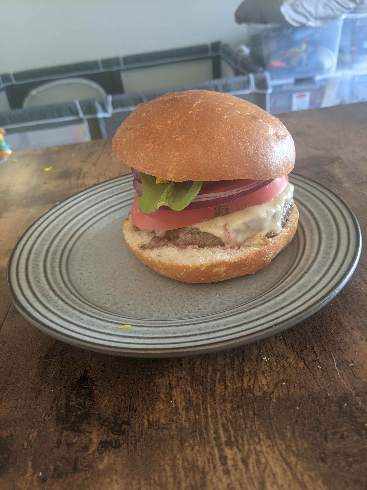

# `American Style Burgers`

`Burgers cooked on cast iron or grill`

## info

* `18min`
* `Even number of burgers`

## ingredients

* `1/2 pound of 80/20 ground beef per burger`
* `Trader Joe's Garlic Salt`
* `1 large heirloom tomato per 4 burgers`
* `1 large red onion per 4 burgers`
* `1 head of lettuce`
* `Trader Joe's pre-sliced Shart Cheddar Cheese`
* `Trader Joe's whole grain mustard`

## steps

Prep

1. `seperate meat into 1/2 pound burgers and season liberally with Garlic Salt`
2. `Slice Heirloom Tomato into 1/2 inch vertical slices`
3. `Slice Red Onion into 1/4 inch vertical slices`

Cook

1. `Preheat the grill to 375 degrees F (medium-high)`
2. `Place the burgers on the grill. Cook 3-4 minutes on the first side. Flip the burgers over and cook an additional 3-4 minutes, until the burgers have reached the desired doneness.`
3. `If adding cheese, lay a slice of cheese on each burger patty about 1 minute before taking the burgers off the grill, so the cheese has a chance to melt.`
4. `Serve the burgers on hamburger buns with optional hamburger toppings.`
