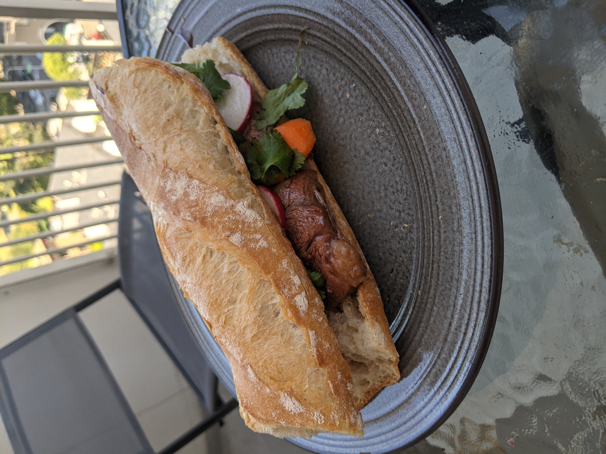

# Panang Neau

`Spicy beef curry`

## info

* `cook time`
* `quantity`

## ingredients

* `primary ingredients`

more ingredients you might already have but should check

* `more ingredients`

## steps

Prep

1. `prep step`

Cook

1. `cooking step`

## notes

* `notes`

## based on

* https://www.seriouseats.com/panang-neua-thai-panang-curry-with-beef
